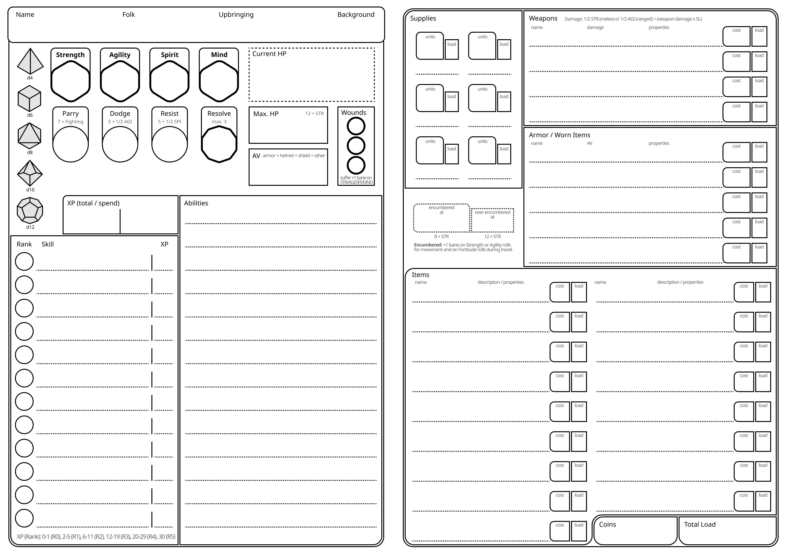
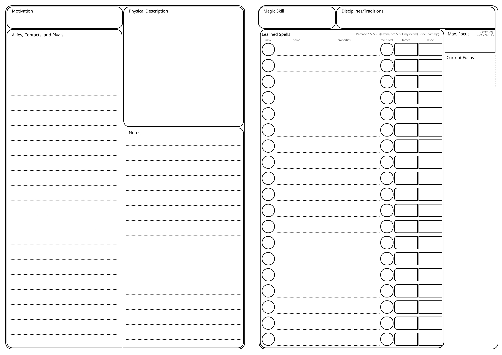

# 📋 Adventurer Creation

## Creation Steps

When creating a new adventurer, follow the steps below:

1. **Choose your Attributes**
    - You start with a d6 in all attributes. You can then choose to increase one attribute to d8, but you must also decrease one to d4 when doing so.
2. **Choose your Folk**
    - Also, choose a culture for your folk. You learn the language of your chosen culture, in addition to the common language of the region.
3. **Choose your Upbringing**
4. **Choose your Background**
5. **Ask yourself the following questions** (you can also leave some of the questions open and determine them dynamically in the story during play)
    - Who is a good friend, colleague, or important family member you can call for aid? (Write down as your Ally)
    - Who is a person in your life that you can rely on for information, knowledge, or skills? (Write down as your Contact)
    - Who did you anger, come into conflict with, or hold a grudge against you? (Write down as your Rival)
    - Why did you become an adventurer? Pick one of the following keywords or choose your own (Write down your Motivation).
    *Duty, Fame, Fortune, Freedom, Justice, Knowledge, Power, Redemption, Revenge, Survival*
6. **Choose your Skills**
    - Your upbringing and background give examples of fitting skills for your adventurer. Write down all suggested skills, or replace any number of them with other skills you see more fitting for your adventurer. At the end, you should have written down exactly seven distinct skills.
    - Choose three of these seven skills to start with 2 XP each. With this, these skills are improved to rank 1 and you can choose one rank 1 talent for each of them. Your other skills start at 0 XP and therefore rank 0. After your adventures, you can spend more XP on your learned skills and unlock talents for them with enough XP.
    - If you learned Archery or Fighting, you learn Combat Arts for weapons of the learned skill. See the Combat Arts section for more details.
    - If you learned Arcana or Mysticism, you learn spells for the learned skill. See the Magic section for more details.
7. **Choose your Equipment**
    - Starting Items:
        - A backpack (holds up to 10 load, 1 load, 10 coins)
        - Two pouches (each holds up to 2 load, 0 load, 1 coin)
        - Traveler‘s Clothes (0 load, 50 coins)
        - Hemp Rope (covers a medium distance, 1 load, 10 coins)
        - Camping kit (provides shelter for a night‘s rest for up to two people, 1 load, 50 coins)
        - One additional tool of your choice
        - Supplies:
            - 2 units (d6) of provisions (1 load, 10 coins per unit)
            - 2 units (d6) of torches (emit bright light in close range and dim light in short range when lit, 1 load, 10 coins per unit)
        - 10 coins (can’t be spent during adventurer creation)
    - You also get 350 coins to spend on additional equipment and items.
        - Choosing a weapon that requires ammo gives you 2 units (d6) of that ammo for free
        - You keep coins you don’t spend
8. **Start with 1 Resolve and fill out the remaining statistics on your adventurer sheet**

### Advanced Adventurer Creation

For a playgroup that already has played Nexus RPG for a while and doesn‘t want to repeat the early phase of adventuring life for their characters, you can decide on one of the following advanced starts.

| Adventuring Tier | Starting XP | Max. Attribute Dice* | Coins |
| --- | --- | --- | --- |
| Tier 1 (fresh) | 12 XP total (max. 4 XP per skill) | d8 | 850 coins |
| Tier 2 (capable) | 24 XP total (max. 8 XP per skill) | d10 | 3,500 coins |
| Tier 3 (experienced) | 36 XP total (max. 12 XP per skill) | d10 | 14,000 coins |
| Tier 4 (seasoned) | 48 XP total (max. 16 XP per skill) | d12 | 70,000 coins |
| Tier 5 (heroic) | 60 XP total (max. 20 XP per skill) | d12 | 350,000 coins |
| Tier 6 (legendary) | 90 XP total (max. 30 XP per skill) | d12 | 1,500,000 coins |

* You can spend 4 XP to increase one of your attributes by one die size. You can do so multiple times up to the max. dice size per Adventuring Tier.

### Smaller Playgroups

This game assumes a group of four adventurers to band together. If your playgroup consists of fewer people than that, consider granting each adventurer one more skill at the XP cap of your chosen starting tier for each player they are below four.

> For example, when playing with a group of two people and no advanced starting tier, they may each choose two more of their skills to invest 2 XP each into. This would leave them with five skills which have 2 XP invested into each of them instead of the normal three skills.
> 

## Adventurer Sheet

You can print out this sheet to record your adventurer's statistics, equipment, and connections within the game world.

