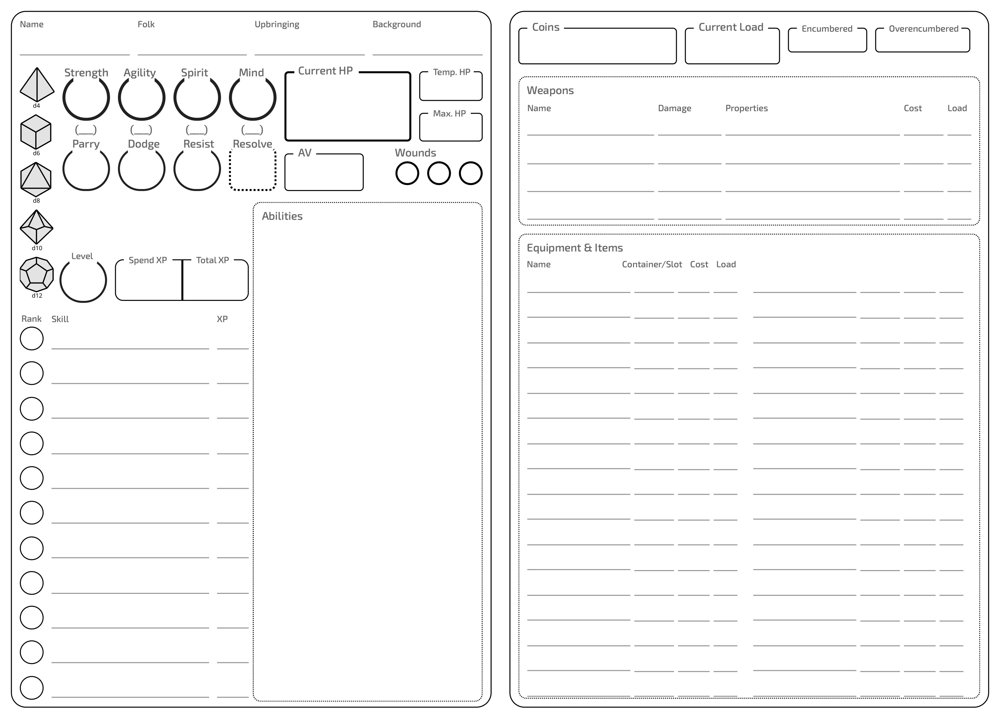

# 📋 Character Creation

> "Courage alone will not carry you across the burning sands. Know your strengths, master your skills, and choose your companions wisely. Only then might you survive long enough to become legend."
> 

## Creation Overview

Creating your adventurer is the first step in your journey through the sun-scorched lands of Atakhet and beyond. This chapter guides you through the process of breathing life into your character—from their innate attributes to their learned skills and chosen equipment.

## Creation Steps

When creating a new adventurer, follow these nine steps:

> 1. Attributes
> 2. Folk
> 3. Upbringing
> 4. Background
> 5. NPC Relationships
> 6. Motivation
> 7. Skills
> 8. Equipment
> 9. Final Details

### 1. Choose Your Attributes

Every adventurer possesses four core attributes that represent their natural capabilities:

- **Strength:** Physical power and endurance
- **Agility:** Speed, reflexes, and coordination
- **Spirit:** Willpower, charisma, and connection to the divine
- **Mind:** Intelligence, analytical thinking, and compatibility for arcane powers

Begin with a d6 in all attributes. You may choose to increase one attribute to d8, but must decrease another to d4 when doing so.

> Example: Sansar the Thief decided to increase their Agility to d8, reflecting their nimble nature, but decreased their Strength to d4, showing their reliance on speed rather than power.
> 

### 2. Choose Your Folk

Select your adventurer's folk—the people they were born among—and their associated culture. This choice shapes not only your adventurer's appearance but also their perspective on the world.

Each folk has unique cultural practices and values. Also choose a specific culture within your folk, such as the sun elves of Atakhet or the ghahar dwarves of the Crimson Mountains.

You automatically learn the language of your chosen culture, in addition to the common trade tongue of the region. Also, an adventurer with at least a d8 Mind can choose one or more additional languages (see the Languages section for more details).

> Example: Arzhag chose to be a dwarf from the ghahar culture. They learn the dwarven language and common trade tongue. Since their Mind is only a d4, they don’t learn additional languages.
> 

### 3. Choose Your Upbringing

Select your adventurer's upbringing from the list provided in the adventurers section. Your upbringing represents how and where you were raised—whether in the grand cities of Atakhet, the nomadic caravans of the outer deserts, or the bustling markets of river settlements. Each upbringing option comes with suggested skills that reflect the capabilities typically learned in that environment.

> Example: Sephi the Seer chose the "Monk" upbringing, which suggested the Education, Insight, and Mysticism skills.
> 

### 4. Choose Your Background

Select your adventurer's background from the list provided in the adventurers section. Your background represents what your adventurer did before answering the call to adventure—whether they served as a temple guardian, worked as a market trader, studied as a scholar of forgotten texts, or hunted with nomadic tribes. Each background comes with additional suggested skills that reflect the expertise developed during that period of your life.

Also, you can gain an advantage in the form of +1 boon on rolls through your background. This is further explained in the Backgrounds section.

> Example: Sansar the Thief selected the "Thug" background, which suggested Athletics, Fighting, Fortitude, and Streetwise as associated skills.
> 

### 5. Determine NPC Relationships

No adventurer exists in isolation. You begin the game with three significant connections to non-player characters (NPCs).

1. Randomly determine each NPC's role or choose from the list in the NPCs & Relationships section
2. Among these three relationships, assign the following dispositions:
    - One **intimate** relationship (+2): Someone who deeply cares for you
    - One **indifferent** relationship (+0): Someone with neutral feelings toward you
    - One **hostile** relationship (-2): Someone who bears ill will toward you

> Example: Arzhag the Warrior has three NPC relationships:
> 
> - A former battle commander (authority role, intimate, +2) who respects Arzhag's courage
> - A merchant from the copper caravans (seeker role, indifferent, +0) who trades with Arzhag occasionally
> - A rival warrior from a neighboring clan (adventurer role, hostile, -2) who believes Arzhag stole their glory

### 6. Define Your Motivation

What drives your adventurer to leave the safety of home and face the unknown dangers of the world? Choose one of the following motivations or create your own:

*Duty, Fame, Fortune, Freedom, Justice, Knowledge, Power, Redemption, Revenge, Survival*

Record your chosen motivation, as it will guide your adventurer's actions and decisions. You can invoke your Motivation once per gaming session to gain Resolve. The rules for this can be found in the Resolve section.

### 7. Choose Your Skills

Your upbringing and background suggest skills fitting for your adventurer. Record seven distinct skills from the following list, either using those suggested by your chosen upbringing and background or replacing any number with others you find more suitable:

*Arcana, Archery, Athletics, Crafting, Education, Fighting, Fortitude, Influence, Insight, Lore, Mysticism, Nature, Perception, Stealth, Streetwise, Survival*

Of these seven skills:

- Select three to start with 2 XP each. These skills begin at rank 1, allowing you to choose one rank 1 talent for each. skill
- The remaining four skills begin at 0 XP (rank 0) and you don’t get a pick for talents.

As you adventure, you'll earn XP to improve these skills and unlock additional talents. Note, that your Character Level restricts the maximum amount of XP you can invest in each individual skill. This means, once you reach that limit for any skill, additional XP available must be spend for any other skills you haven’t improved to your current limit.

**Special Skills:**

- If you select **Archery** or **Fighting**, you learn Combat Arts for weapons associated with that skill. You can learn one Combat Art for rank 0 or two Combat Arts for rank 1 in these skills. See the Combat Arts section for details.
- If you select **Arcana** or **Mysticism**, you learn spells associated with that skill. See the Magic section for details.
- If you select **Crafting**, you learn one crafting profession. See the Crafting Professions section for details.

> Example: Nagkhan the Sorcerer selected these seven skills: Arcana, Education, Influence, Insight, Lore, Perception, and Survival. They chose Arcana, Lore, and Influence as their rank 1 skills (2 XP each), gaining one talent for each. Their other skills started at rank 0. Also, they can choose one arcane discipline to specialize in for their Arcana skill and four arcane spells of rank 0 or 1 for that discipline.
> 

### 8. Choose Your Equipment

Every adventurer begins with the following standard equipment:

**Starting Items:**

- A backpack (0 load for your first one, normally 1 load, worth 15 coins)
- Two pouches (can hold up to 1 load each, 0 load, worth 5 coins each)
- Traveler's Clothes (0 load when worn, normally 1 load, worth 25 coins)
- Hemp Rope (covers a medium distance, 1 load, worth 10 coins)
- Camping kit (shelter for up to two people, 1 load, worth 50 coins)
- One additional tool of your choice
- **Supplies:**
    - Rations (d4 Supply die, 1 load, worth 15 coins per unit)
    - Torches (d4 Supply die, emit bright light in close range and dim light in short range when lit, 1 load, worth 15 coins per unit)
- 10 coins (cannot be spent during character creation)

Additionally, you receive 350 coins to spend on equipment and items of your choice:

- Selecting a weapon requiring ammunition gives you one unit of that ammunition for free (e.g., arrows (d8) for a bow)
- You keep any unspent coins

> Example: Arzhag the Warrior spent their 350 coins on a battleaxe (100 coins), a light shield (150 coins), leather armor (50 coins), and kept 50 coins for future needs.
> 

### 9. Final Details

Record that you start your first adventure with 1 Resolve and complete any remaining statistics on your adventurer sheet, such as calculating your HP or maximum load based on your Strength.

## Character Growth

As you journey through the lands of Atakhet and beyond, your adventurer will grow in capabilities:

- Earn XP to increase skill ranks and gain new talents
- Find or purchase better equipment
- Forge new relationships with NPCs
- Discover ancient secrets and powerful artifacts

Remember that the journey of an adventurer is never complete—there are always new horizons to explore and challenges to overcome.

## Character Sheet

Use this sheet to record your adventurer's statistics, equipment, and connections within the game world.

