# 🧝‍♀️ Folk

> "From the mountain jungles, through the savage savannah plains, across the burning sands of Atakhet, to the vast mangrove delta where water meets sea — each folk has found their place. The gods created us different not to divide, but to ensure we might survive in all the realms of creation."

The world is home to diverse folk, each with their own unique traits, cultures, and histories. During adventurer creation, you will choose one of these folk for your character, defining not only their physical characteristics but their cultural heritage as well.

## Summary

| Folk | What Makes Them Special |
| --- | --- |
| Dwarf | Sturdy crafters with stone affinity; resilient against poison and hard to knock down |
| Elf | Spiritually attuned to nature; fleet-footed and perceptive in dim light |
| Gnome | Natural empaths with innate mind-sense; gifted at detecting illusions |
| Hune | Towering and stoic; exceptional strength and iron-willed endurance |
| Orc | Fierce melee warriors; pride above death and devastating critical strikes |
| Goblin | Cunning tricksters; quick to escape and stealthy despite small stature |
| Human | Boundlessly adaptable with innate arcane potential; persevering against all odds |
| Catfolk | Proud hunters with keen night vision; intimidating roar and sharp natural claws |
| Lizardfolk | Cold-blooded survivors; thick natural scales and amphibious endurance |
| Minotaur | Horned guardians with formidable strength; devastating goring charge |
| Dogfolk | Loyal pack hunters with keen senses; sharp noses and ears make them unrivaled trackers |
| Satyr | Free-spirited revelers with innate tolerance to magic ; sure-footed in wild terrain |

## Character Creation: Physical Traits

When creating your adventurer, you may use the following tables to determine your character's age, height, and weight. Roll dice as indicated for each trait, or choose a value within the range provided.

| Folk | Age* | Height (cm) | Weight (kg) |
| --- | --- | --- | --- |
| Dwarf | 30 + 2d8 | 115 + 2d6 | 65 + 2d4 x 3 |
| Elf | 40 + 2d10 | 165 + 2d8 | 45 + 2d6 x 2 |
| Gnome | 30 + 2d8 | 90 + 2d4 | 15 + 2d4 |
| Hune | 25 + 2d8 | 200 + 2d10 | 80 + 2d10 x 3 |
| Orc | 12 + 2d6 | 170 + 2d10 | 60 + 2d8 x 2 |
| Goblin | 10 + 2d4 | 90 + 2d4 | 15 + 2d4 |
| Human | 14 + 2d6 | 160 + 2d8 | 50 + 2d6 x 2 |
| Catfolk | 14 + 2d6 | 180 + 2d10 | 60 + 2d8 x 2 |
| Lizardfolk | 10 + 2d4 | 170 + 2d8 | 60 + 2d8 x 2 |
| Minotaur | 25 + 2d8 | 190 + 2d10 | 70 + 2d10 x 3 |
| Dogfolk | 14 + 2d6 | 160 + 2d8 | 50 + 2d6 x 2 |
| Satyr | 16 + 2d8 | 160 + 2d8 | 50 + 2d6 x 2 |

* for characters starting at higher levels, you can add an additional die for each level above one.

### Age Groups per Folk

| Folk | Adulthood* | Middle-Aged | Old | Venerable** |
| --- | --- | --- | --- | --- |
| Dwarf | 40 | 80 | 120 | 160+ |
| Elf | 50 | 100 | 150 | 200+ |
| Gnome | 35 | 70 | 110 | 140+ |
| Hune | 30 | 60 | 90 | 120+ |
| Orc | 14 | 30 | 45 | 60+ |
| Goblin | 12 | 25 | 35 | 50+ |
| Human | 16 | 35 | 55 | 70+ |
| Catfolk | 16 | 40 | 60 | 80+ |
| Lizardfolk | 12 | 25 | 35 | 50+ |
| Minotaur | 30 | 60 | 90 | 120+ |
| Dogfolk | 14 | 30 | 45 | 60+ |
| Satyr | 20 | 45 | 70 | 90+ |

* These ages indicate physical adulthood. Being considered mentally adult differs from culture to culture.

** This roughly indicates the natural life span of each Folk. Depending on good health or the gods’ favour, mortals can surpass this point in age by some years or even decades.

## Folk

### Dwarf

> "The stone remembers what flesh forgets. From the mountain quarries to the desert monuments, our crafts endure when empires crumble to dust."

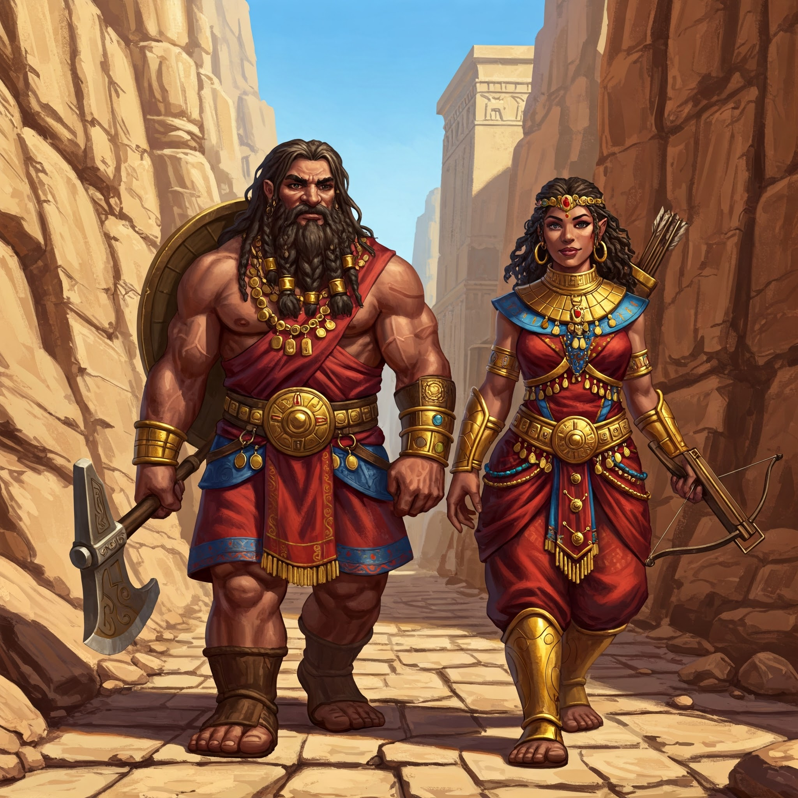

Carved of the stone itself, dwarves maintain a deep connection to the earth. They are masters of mining and metalworking, renowned for their craftsmanship and skill. They value honor and tradition, and their unyielding determination reflects their unbreakable bond with the earth. In Atakhet, dwarven stoneworkers are highly prized for their ability to craft monuments that withstand the harsh desert conditions.

**Cultures**

| Culture | Region | Description |
| --- | --- | --- |
| Mahruk (Gold-Dwarves) | Northern Islands | Merchant dwarves and seafarers from the northern islands |
| Ghahar (Fortress-Dwarves) | Atakhet | Master architects who construct impregnable strongholds, often serving as royal engineers in Atakhet |
| Urduk (Grey-Dwarves) | Ashen Badlands | Djinn-serving dwarves from the ashen badlands |
| Dhurvar (Ice-Dwarves) | Northern Mountains | Stoic mountain dwellers who carve their homes from snow-covered mountainsides |

**Size.** Dwarves are medium sized, growing to 1.20 to 1.30 meters tall on average with a squat build.

**Age.** Dwarves reach adulthood at 40 and are considered of old age at 110 years. They can live up to 150 years on average.

**Dwarven Sight.** You can roughly make out differences in temperature by sight, granting you vision even in total darkness. You can see at melee range in absolute darkness as in bright light and up to a medium distance as in dim light.

**Stoneskin.** You gain +1 AV. When you have to roll with Fortitude to withstand poison, intoxication, or illness, you gain +1 boon on the roll.

**Squat Build.** You impose +1 bane on rolls that attempt to knock you prone or push you. Also when you are pushed, reduce the distance by one step (if you are pushed close, instead you aren't pushed at all).

### Elf

> "We do not conquer the land—we commune with it. From the sacred river's source in the distant mountains to its delta where it meets the sea, each drop of water, each grain of sand carries a spirit you cannot hear."

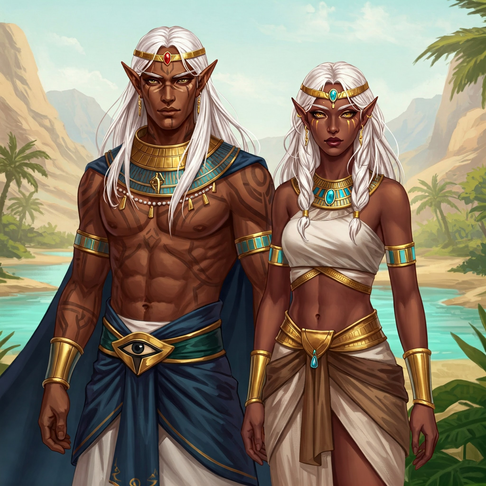

Living in a spiritual symbiotic state with the life force of nature in their immediate environment, elves are intimately connected to the natural world. They are sensitive to changes in their surroundings and suffer physically when in barren or lifeless terrain for too long. They are often aloof and unapproachable, but their fierce loyalty to their home and way of life is unwavering. In the realm of Atakhet, the Ra'thep sun-elves have adapted to channel the desert's harsh energies, ruling as divine representatives blessed by the sun.

**Cultures**

| Culture | Region | Description |
| --- | --- | --- |
| Anutep (Sun-Elves) | Atakhet | Dark-skinned desert dwellers who rule Atakhet as divine representatives, drawing power from the sun |
| Sylvar (Forest-Elves) | Distant Forests | Secretive woodland protectors who rarely venture beyond their forest borders |
| Alfir (Shadow-Elves) | Distant Realms | Nocturnal elves who dwell in twilight realms and ancient tombs |
| Ho'shien (River-Elves) | Great Rivers | Nomadic traders who follow the great rivers, serving as vital links between isolated communities |

**Size.** Elves are medium sized, growing slightly taller than humans at 1.70 to 1.80 meters tall on average with a slender build.

**Age.** Elves reach adulthood at 45 and are considered of old age at 150 years. They can live up to 200 years on average.

**Night Vision.** You can see one range category further from sources of bright and dim light.

**Fleet-Footed.** You can choose to gain +1 Movement during your turn. You can use this ability once per combat.

**Spiritual Symbiosis.** You take nourishment from the natural world around you. While in the wilderness with lush vegetation, you only need to sleep for 4 hours each night, allowing you to use the remaining 4 hours for light non-physical activity.

### Gnome

> "Your thoughts shine like torches in the night. From the river's source to its mangrove delta, secrets flow like water. From us? How amusing."

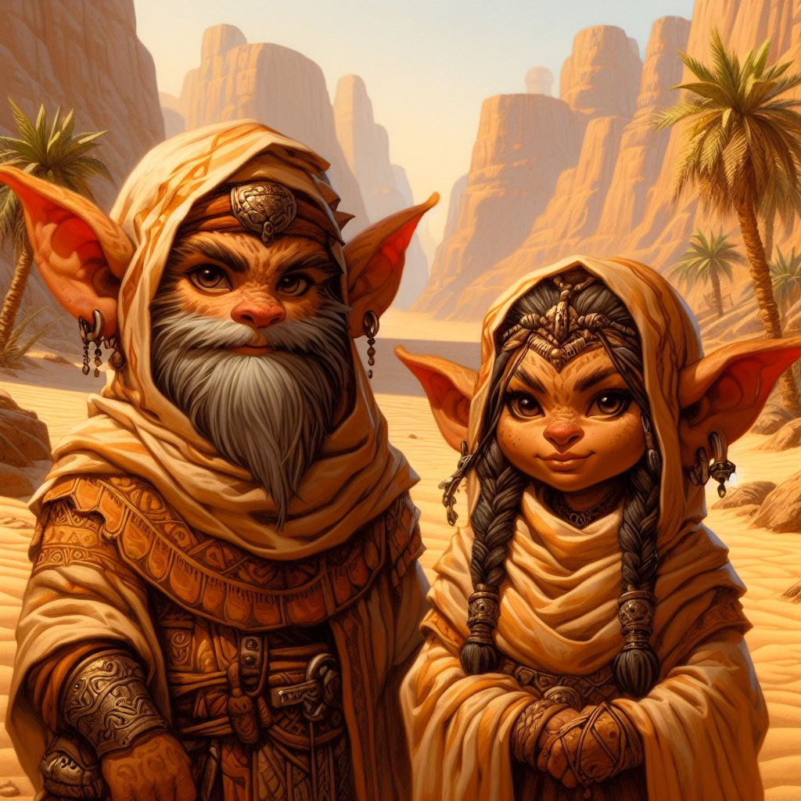

Natural psychics with the ability to read other people's intentions and surface thoughts, the child-sized gnomes are an open and harmonious culture. However, this often makes them naive when faced with other folk who attempt to deceive them. Their playful nature is a welcome addition to any company. In Atakhet, gnomes often serve as diplomatic intermediaries, using their empathic abilities to foster understanding between different folk.

**Cultures**

| Culture | Region | Description |
| --- | --- | --- |
| Auflin (Willow-Gnomes) | Oases & Waterways | Gentle river-dwellers who establish communities near oases and waterways |
| Burrin (Den-Gnomes) | Underground | Industrious tunnel-builders who create elaborate underground communities |

**Size.** Gnomes are of small size, growing up to 0.90 to 1.00 meters tall on average with a stout build.

**Age.** Gnomes reach adulthood at 25 and are considered of old age at 80 years. They can live up to 120 years on average.

**Natural Empath.** You can read the surface thoughts and emotions of any close creature by rolling Spirit + Insight. You can also project your feelings to a creature close to you, allowing you to communicate simple ideas with animals and other creatures. You also intuitively know how many living creatures are close to you and their general direction.

**Scent of Illusions.** You can instinctively make out illusions and invisible things. You gain +1 boon on Spirit rolls to identify magical falsehoods and illusions and impose +1 bane on rolls to fool you with falsehoods or illusions.

**Small Stature.** You are of small size. This grants you the following effects:

- You gain +1 boon on Agility rolls to hide or move stealthily.
- You can only wield versatile weapons two-handed and don't add a bonus to weapon damage from it.
- Increase the Strength requirement for heavy weapons you wield by +1d (max. d12).

### Hune

> "We have watched civilizations rise and fall like the river delta's tides. From mountain peaks to swampland depths, patience is our greatest strength."

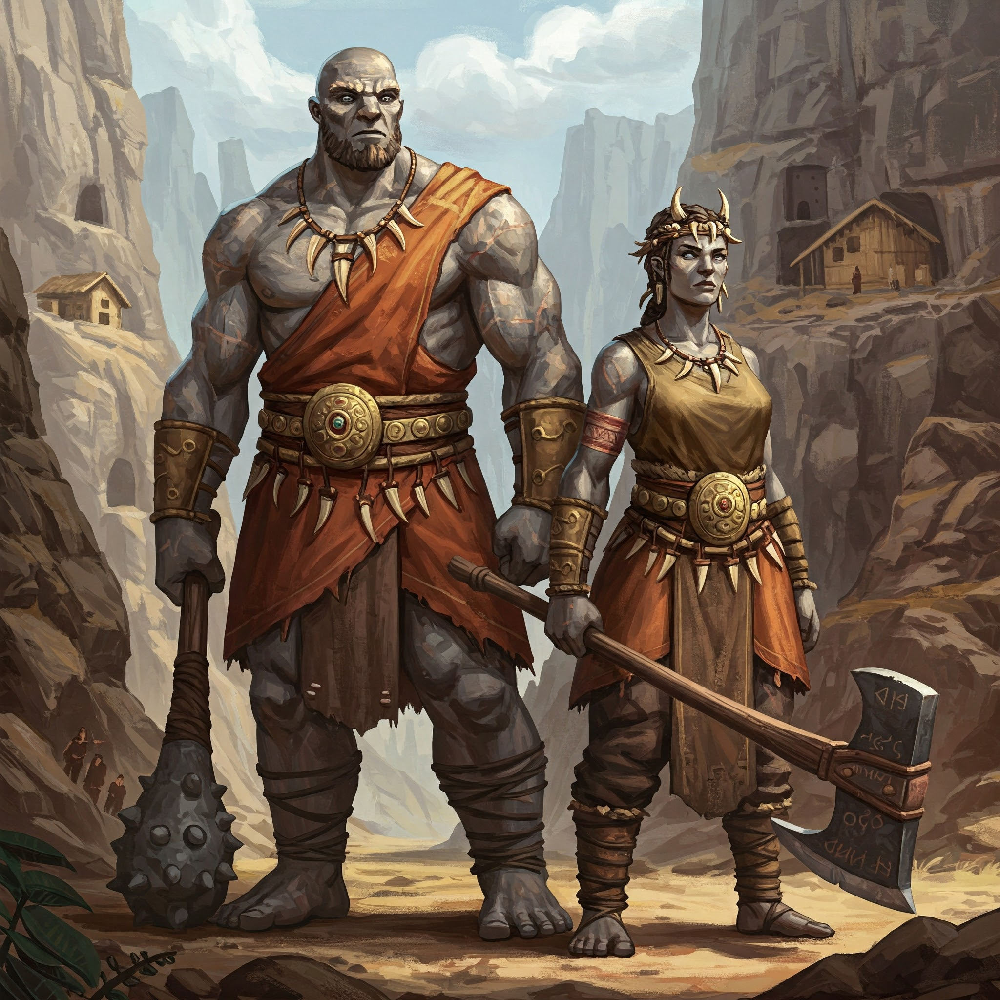

A race of towering beings with incredible strength and endurance. They are often nomadic and reclusive but possess a deep wisdom and knowledge of the world. In the deserts of Atakhet, Hunes are often sought out as caravan guards or builders for grand monuments, their strength and endurance invaluable in the harsh climate.

**Cultures**

| Culture | Region | Description |
| --- | --- | --- |
| Hataar (Mountain-Hunes) | Mountains | Solitary herders and guardians of ancient mountain passes |
| Empyros (Island-Hunes) | Islands | Seafaring traders who connect distant shores through elaborate trade networks |
| Jotnir (Ice-Hunes) | Frozen North | Frost-resistant nomads who navigate the frozen north with ease |
| Ta'uuri (Island-Hunes) | Coastal Islands | Coastal dwellers who build impressive stone harbors and lighthouses |

**Size.** Hunes are medium sized, growing to 2.10 to 2.30 meters tall on average.

**Age.** Hunes reach adulthood at 30 and are considered of old age at 100 years. They can live up to 130 years on average.

**Giant's Blood.** +2 HP. You also gain the following effects:

- Add +2 to your carrying capacity.
- Decrease the Strength requirement for heavy weapons you wield by -1d (min. d4).

**Stoic Mind.** +1 Resist. You gain +1 boon on Spirit + Fortitude rolls.

### Orc

> "Our ancestors' deeds do not define us, but their strength flows in our veins like the great river through the desert. We build terraces on the mountain slopes where they once only destroyed."

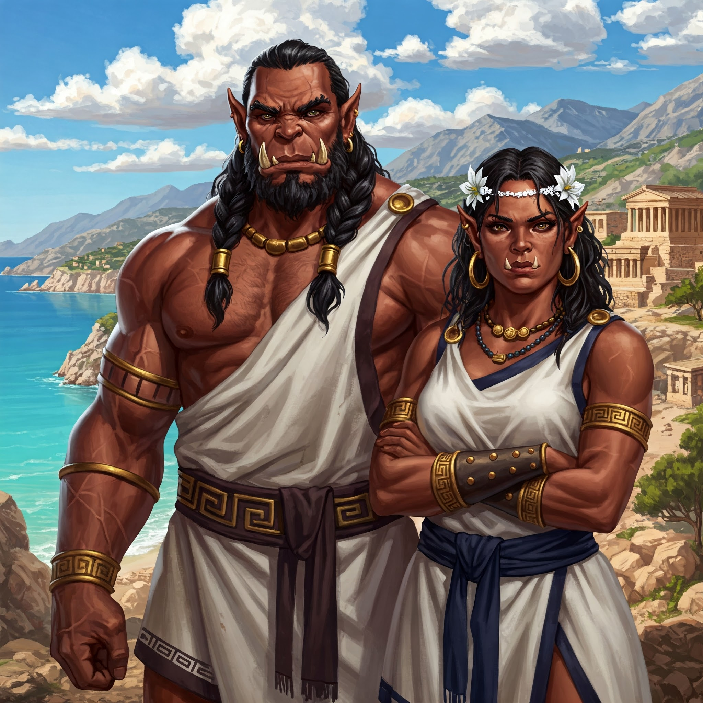

Coming from once violent and brutal cultures, the orcs have a reputation for savagery that many have worked hard to overcome. While many have adopted a more civilized life, they are often judged by the deeds of their ancestors rather than their own merits. Despite this, orcs value strength and honor above all else, and their fierce determination and indomitable will make them formidable allies. In Atakhet, many orcs serve as elite mercenaries or skilled craftspeople, gradually earning respect through their deeds rather than their lineage.

**Cultures**

| Culture | Region | Description |
| --- | --- | --- |
| Orgon (Island-Orcs) | Coastal Islands | Seafaring warriors and traders who establish coastal settlements |
| Gataka (Jungle-Orcs) | Jungles | Expert hunters and trackers who navigate dense forests with ease |
| Jinkai (Mountain-Orcs) | Misty Valleys | Mountain-dwelling orcs from the misty valleys with a culture of honor and metal-smithing |

**Size.** Orcs are medium sized, growing to 1.80 to 1.90 meters tall on average.

**Age.** Orcs reach adulthood at 14 and are considered of old age at 45 years. They can live up to 60 years on average.

**Orcish Fury.** When you roll a critical success on an attack with a melee weapon, add your weapon damage an additional time to the total damage.

**Pride above Death.** When you suffer one Injury, you can choose to ignore it. You can use this ability once per day.

### Goblin

> "Underestimated is exactly where I prefer to be. Whether in the crowded bazaars or the dense mangrove swamps of the delta, by the time they realize their mistake, their coin purse is already in my hand."

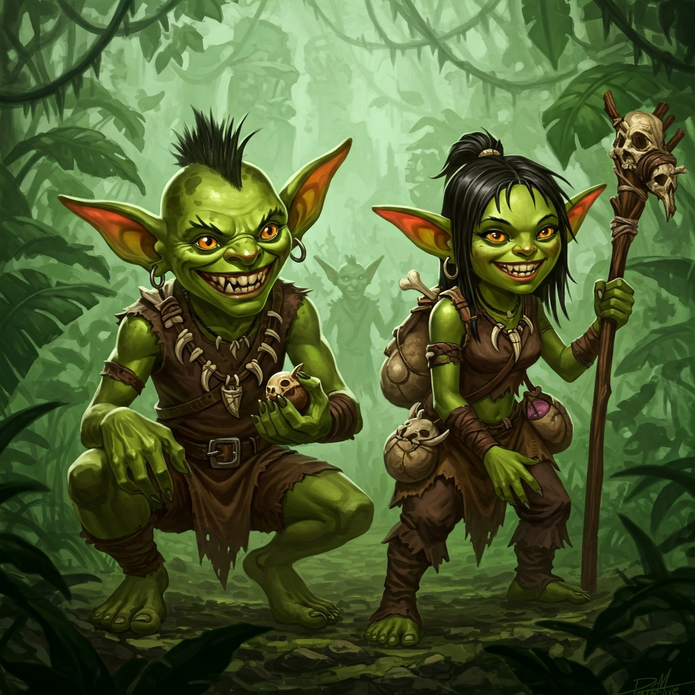

A cunning and resourceful race of small build, with a knack for trickery and deception. They are often viewed as untrustworthy and sneaky, but their ingenuity can be a valuable asset. In the deserts of Atakhet, goblins often serve as scouts or messengers, their small size and quick wits allowing them to navigate both the physical and social landscapes with surprising effectiveness.

**Cultures**

| Culture | Region | Description |
| --- | --- | --- |
| Sniknez (Cave-Goblins) | Caves & Tunnels | Subterranean dwellers who excel at finding hidden passages and resources |
| Goki (Jungle-Goblins) | Jungles | Agile climbers who establish communities in cliffs and treetops |

**Size.** Goblins are of small size, growing up to 0.90 to 1.00 meters tall on average with a skinny build.

**Age.** Goblins reach adulthood at 10 and are considered of old age at 35 years. They can live up to 45 years on average.

**Night Vision.** You can see one range category further from sources of bright and dim light.

**Quick Escape.** When an enemy misses you with a melee attack, you can choose to move close without provoking Opportunity Attacks. You can use this ability once between turns.

**Small Stature.** You are of small size. This grants you the following effects:

- You gain +1 boon on Agility rolls to hide or move stealthily.
- You can only wield versatile weapons two-handed and don't add a bonus to weapon damage from it.
- Increase the Strength requirement for heavy weapons you wield by +1d (max. d12).

### Human

> "They fear what flows in our veins, yet seek to harness it like the waters of the great river. We walk a dangerous path between power and persecution, from the savannah's edge to the temple steps."

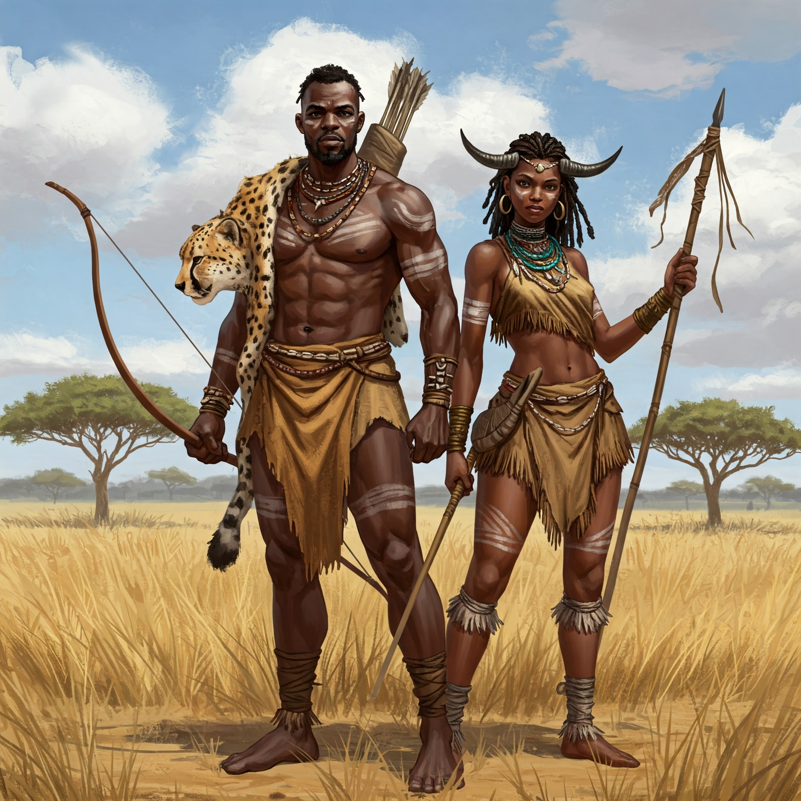

A resilient and adaptable people, humans possess a natural arcane ability that sets them apart from other folk. Others sometimes try to subjugate them to make use of their natural gifts as a weapon. As a result, humans are often caught between fear and exploitation, struggling to find their place in a world that both values and fears their power. But their incredible adaptability and boundless ambition have allowed them to thrive despite these challenges. In Atakhet, humans often serve as advisors or arcane specialists, their natural magical talents both valued and closely monitored.

**Cultures**

| Culture | Region | Description |
| --- | --- | --- |
| Khatok (Savannah-Humans) | Savannah | Nomadic tribes who navigate the grasslands at the desert's edge, many of them were brought to Atakhet for manual labor |
| Vornheimr (Snow-Humans) | Northern Lands | Hardy northerners who rarely venture into the southern deserts |

**Size.** Humans are medium sized, growing to 1.60 to 1.80 meters tall on average.

**Age.** Humans reach adulthood at 18 and are considered of old age at 60 years. They can live up to 80 years on average.

**Will of Perseverance.** Re-roll the result of one test and take the new result. You can use this ability once per day.

**Arcane Awakening.** You have a natural talent for the arcane arts. If you have learned Arcana, you gain +2 Focus. You can cast arcane spells without a Spell Catalyst, but suffer +1 bane on the roll.

### Catfolk

> "We hunt not just with claws and teeth, but with patience and respect. The savannah's beasts and the jungle's shadows have taught us when to strike and when to wait."

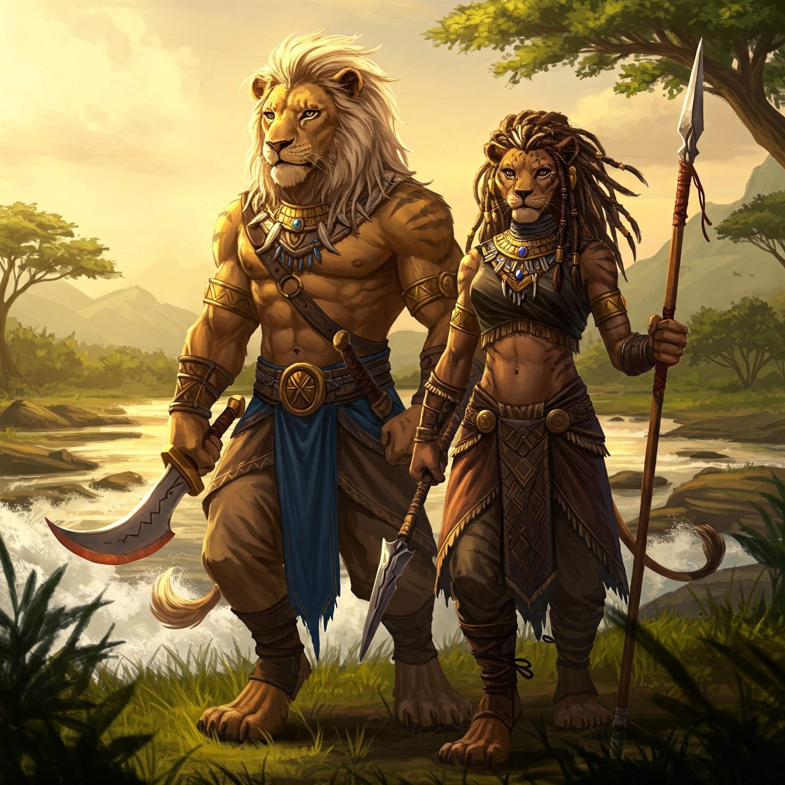

A proud and regal race, with a deep connection to the natural world and a reverence for the power of the hunt. They are often viewed as noble and honorable, but their fierce pride can make them difficult to work with. In the realm of Atakhet, lionfolk often serve as desert guides or warriors, their natural hunting instincts and keen senses invaluable in the harsh environment.

**Cultures**

| Culture | Region | Description |
| --- | --- | --- |
| Jakharii (Savannah-Lionfolk) | Savannah | Tribal hunters who form tight-knit prides and control vast territories |
| Saghal (Jungle-Pantherfolk) | Jungles | Stealthy predators who blend into their surroundings with remarkable ease |

**Size.** Catfolk are medium sized, growing up to 1.90 to 2.00 meters tall on average.

**Age.** Catfolk reach adulthood at 20 and are considered of old age at 65 years. They can live up to 90 years on average.

**Night Vision.** You can see one range category further from sources of bright and dim light.

**Intimidating Roar.** You can use your Action in combat to unleash a powerful lion's roar. Roll Strength + Fortitude vs. Resist against each creature within short range. On a success, they are frightened of you. They can roll Spirit + Fortitude at the start of their turns. On a success, they stop being frightened. You can use this ability once per combat.

**Sharp Claws.** You can use your claws (2 weapon damage, light, slash) as brawling weapons instead of unarmed attacks.

### Lizardfolk

> "We remember when the desert was an ocean. Our blood is cold, but our memories are long, flowing from the mountain jungles to the vast delta swamps where we make our homes."

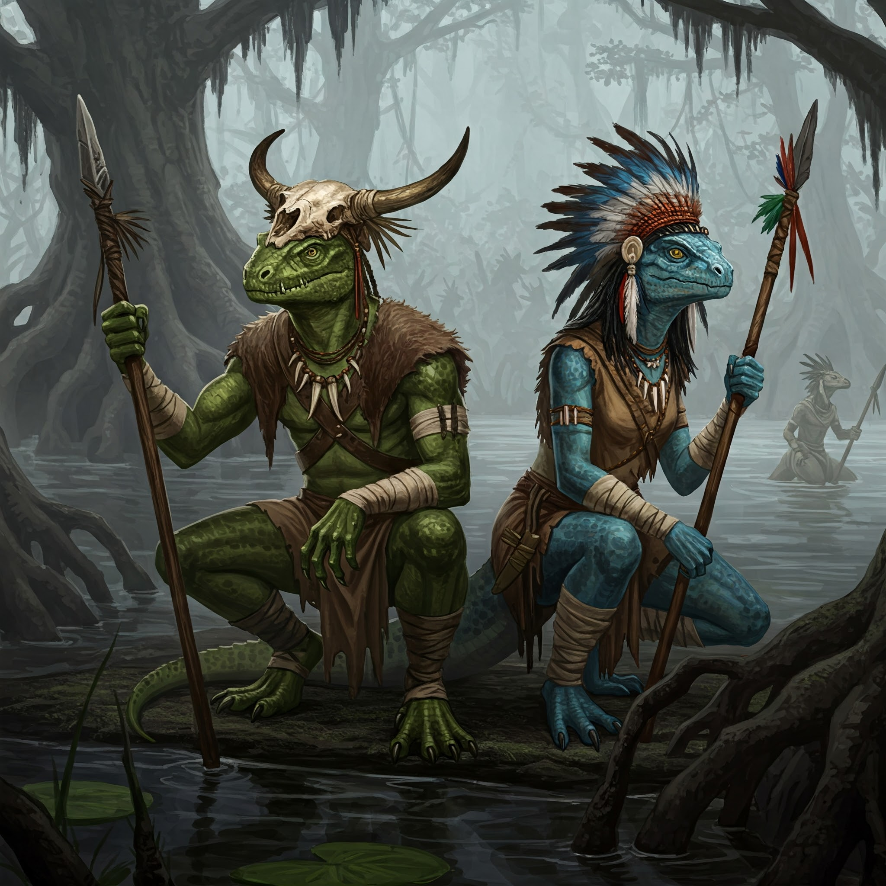

A cold-blooded and inscrutable species, with a deep connection to the swamps and marshes where they make their homes. They are often viewed as mysterious and dangerous but possess wisdom and cunning born of their harsh environment. In Atakhet, lizardfolk are often found near the life-giving oases and rivers, serving as guardians of these precious water sources.

**Cultures**

| Culture | Region | Description |
| --- | --- | --- |
| Vaashk (Swamp-Lizardfolk) | Wetlands & Deltas | Amphibious dwellers who establish communities in wetlands and river deltas |
| Quexa-kul (Jungle-Lizardfolk) | Jungles | Colorful tribes who move with surprising stealth through dense vegetation |

**Size.** Lizardfolk are medium sized, growing up to 1.80 to 1.90 meters tall on average.

**Age.** Lizardfolk reach adulthood at 10 and are considered of old age at 35 years. They can live up to 45 years on average.

**Thick Scales.** Your natural scales grant +3 AV (armor bonus). If you have another higher armor bonus, gain +1 AV instead.

**Aquatic Nature.** You can hold your breath for 4 + 1/2 Strength minutes.

**Reptile Jaws.** You can use your bite (3 weapon damage, crush) as a brawling weapon instead of unarmed attacks.

### Minotaur

> "Our horns may be fearsome, but our hearts honor the ancient ways. We guard the sacred mountain passes and river crossings that others have forgotten, from savannah to delta."

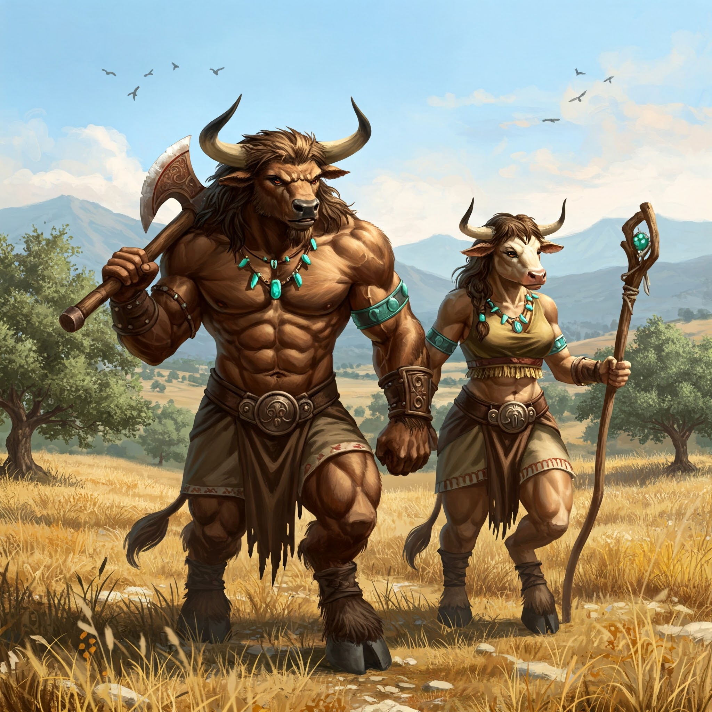

A horned, furry species known for their immense strength and unwavering determination. They are fiercely protective of their clan and territories, often seen as guardians of sacred places. Their physical prowess is matched by their sense of honor, making them formidable allies and respected adversaries. In Atakhet, minotaurs often serve as temple guardians or caravan protectors, their imposing presence deterring all but the most determined threats.

**Cultures**

| Culture | Region | Description |
| --- | --- | --- |
| Minokos (Island-Minotaurs) | Islands | Seafaring traders who navigate treacherous waters with confidence |
| Enkeddu (Grassland-Minotaurs) | Grasslands | Nomadic herders who follow seasonal migration patterns |
| Yettnar (Mountain-Minotaurs) | Mountains | Solitary mountain dwellers who guard ancient passes and shrines |
| Khutu (Steppe-Minotaurs) | Steppes | Swift runners who serve as messengers across vast plains |

**Size.** Minotaurs are medium sized, growing up to 2.00 to 2.10 meters tall on average.

**Age.** Minotaurs reach adulthood at 25 and are considered of old age at 80 years. They can live up to 120 years on average.

**Giant's Blood.** +2 HP. You also gain the following effects:

- Add +2 to your carrying capacity.
- Decrease the Strength requirement for heavy weapons you wield by -1d (min. d4).

**Horns.** You can use your horns (3 weapon damage, crush) as a brawling weapon instead of unarmed attacks.

**Goring Charge.** After you spend 1 or more Movement towards a creature and hit them with an attack using your horns, add your weapon damage an additional time to the total damage.

### Dogfolk

> "The pack endures where the lone hunter falters. Our noses read the wind like scholars read their scrolls—every scent a story, every trail a promise kept."

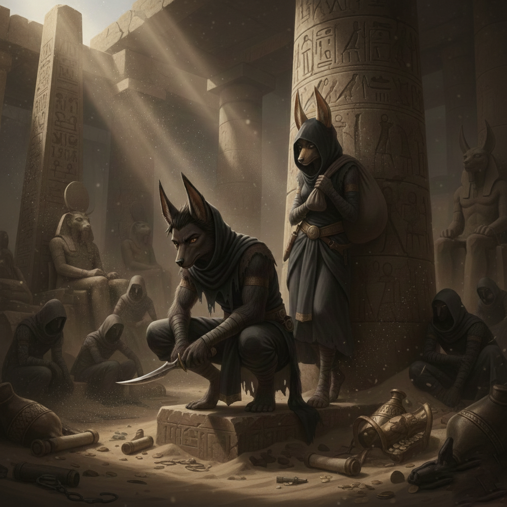

Dogfolk are a canine folk with keen senses and an unshakable loyalty to their kin. Their sharp ears and powerful noses make them unparalleled trackers, while their pack instincts drive them to protect their companions at any cost. Though sometimes dismissed by other folk as overly trusting, their dedication and reliability have earned them a respected place in many communities. In Atakhet, dogfolk often serve as caravan scouts, border patrols, and desert trackers, their senses invaluable for navigating the treacherous sands and detecting hidden dangers.

**Cultures**

| Culture | Region | Description |
| --- | --- | --- |
| Anubar (Desert-Dogfolk) | Atakhet Desert | Jackal-featured trackers who patrol the desert borders and serve as scouts for the great cities of Atakhet |
| Warufi (Plains-Dogfolk) | Grasslands | Wild-dog-featured nomads who run in tight-knit packs across the grasslands, serving as messengers and herders |
| Fenrin (Northern-Dogfolk) | Northern Forests | Wolf-featured hunters who thrive in cold forests and mountainous terrain |

**Size.** Dogfolk are medium sized, growing to 1.60 to 1.80 meters tall on average with a lean, athletic build.

**Age.** Dogfolk reach adulthood at 14 and are considered of old age at 45 years. They can live up to 60 years on average.

**Keen Senses.** You have an extraordinary sense of smell and hearing. You gain +1 boon Perception rolls based on smell. You can detect the presence and general direction of creatures within close range by scent alone, even if you can't see them, as long as air can reach you from their location. Weather or other environmental factors may hinder this ability.

**Pack Loyalty.** While you are close to an ally, you can choose to gain +1 boon on a melee attack and that ally also briefly gains +1 boon on their next melee attack against the same target. You can use this ability once per scene.

**Bite.** You can use your bite (2 weapon damage, crush) as a brawling weapon instead of unarmed attacks.

### Satyr

> "Why do you build walls of stone when the forest offers shelter, the river offers song, and the wind offers freedom? Come, drink, and let the music carry your sorrows away."

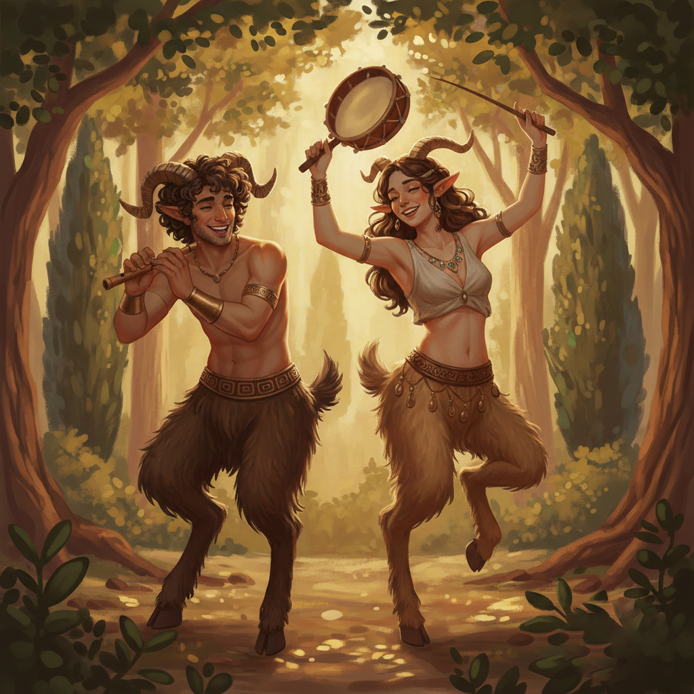

Satyrs are a spirited and free-willed folk with the legs and horns of goats. Known for their love of music, revelry, and the natural world, satyrs are deeply connected to wild places and resist the constraints of civilization. Their innate resistance to magic and supernatural charm makes them remarkably difficult to manipulate, a trait that has served them well in a world full of sorcery. In Atakhet, satyrs are often found in the lush oases and mountain valleys that border the desert, serving as musicians, herbalists, and guides through the wilderness.

**Cultures**

| Culture | Region | Description |
| --- | --- | --- |
| Aighar (Oasis-Satyrs) | Desert Oases | Wandering musicians and herbalists who travel between the desert oases, bringing news and entertainment |
| Kitharo (Mountain-Satyrs) | Highlands | Agile climbers who dwell in the rocky highlands, known for their wild dances and fierce independence |
| Faundel (Forest-Satyrs) | Distant Forests | Woodland dwellers who guard ancient groves and sacred springs |

**Size.** Satyrs are medium sized, growing to 1.60 to 1.80 meters tall on average with a wiry build.

**Age.** Satyrs reach adulthood at 20 and are considered of old age at 70 years. They can live up to 90 years on average.

**Wild Resilience.** When you take damage from a spell or are affected by a magical effect that applies a condition, you can choose to either gain resistance against the damage or negate the condition. You can use this ability once per scene.

**Horns.** You can use your horns (2 weapon damage, crush) as a brawling weapon instead of unarmed attacks.

**Woodland Stride.** You treat difficult terrain caused by natural vegetation as normal terrain. You also gain +1 boon on Agility + Athletics rolls to climb or traverse natural environments.
