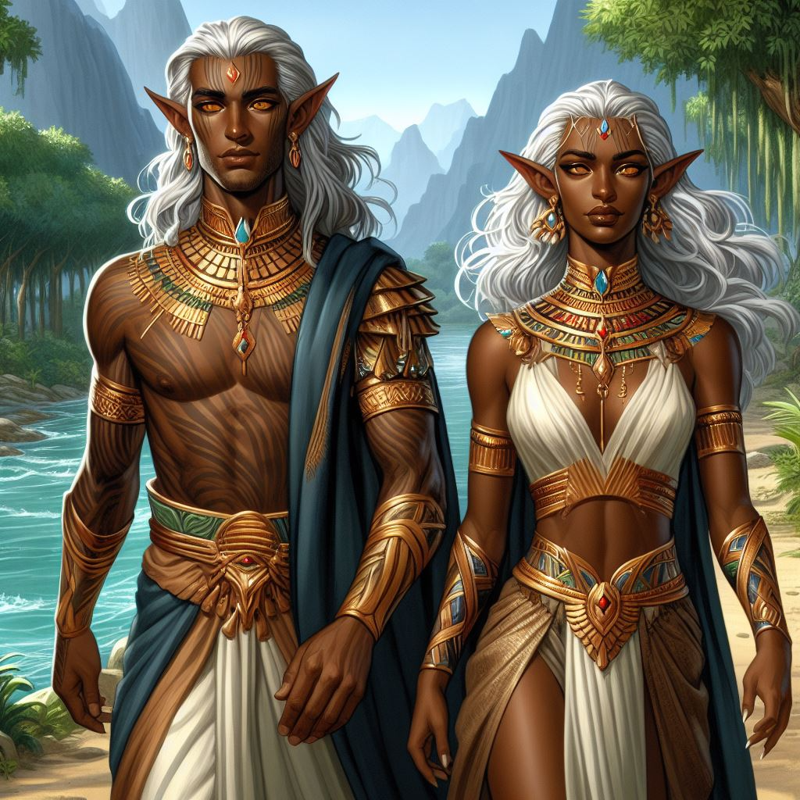
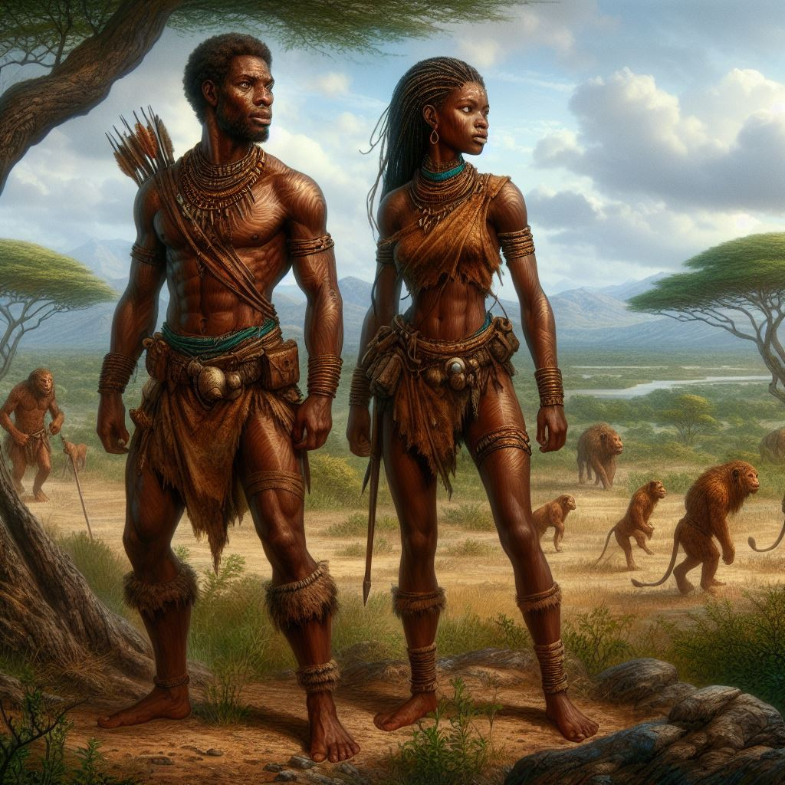
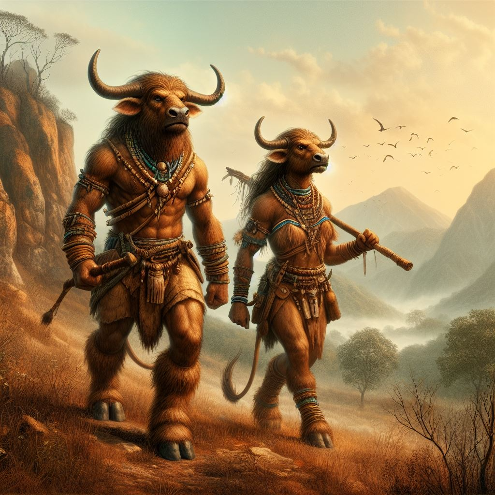

# 🧝‍♀️ Folk

During adventurer creation, choose one of these Folks for your adventurer to be. Each folk also has various cultures, which are home to different regions of the world.

## The Old Folk

The Old Folk consist of those species that have a cultural history spanning thousands of years. All of them have been through great achievements and wealth, but also tragedy and catastrophe.

### Dwarf

Carved of the stone itself, the dwarves have a deep connection to the earth. They are masters of mining and metalworking and are renowned for their craftsmanship and skill. They value honor and tradition, and their unyielding determination is a testament to their unbreakable bond with the earth.

**Cultures:** Dhurvar (Ice-Dwarves), Mahruk (Gold-Dwarves), Ghahar (Fortress-Dwarves), Urduk (Grey-Dwarves)

**Size.** Dwarves are medium sized, growing to 1,20 to 1,30 meters tall on average with a squat build.

**Age.** Dwarves reach adulthood at 35 and are considered of old age at 110 years. They can live up to 150 years on average.

**Dwarven Sight.** You can roughly make out differences in temperature by sight, granting you vision even in total darkness. You can see at melee range in absolute darkness as in bright light and up to a medium distance as in dim light.

**Stoneskin.** You gain +1 AV. When you have to roll with Fortitude to withstand poison, intoxication, or illness, you gain +1 boon on the roll.

**Squat Build.** You impose +1 bane on rolls that attempt to knock you prone or push you. Also when you are pushed, reduce the distance by one step (if you are pushed close, instead you aren‘t pushed at all).

### Elf

Living in a spiritual symbiotic state with the life force of nature in their immediate environment, the elves are intimately connected to the natural world. They are sensitive to changes in their surroundings and suffer physically when in barren or lifeless terrain for too long. They are often aloof and unapproachable, but their fierce loyalty to their home and way of life is unwavering.

**Cultures:** Ra’thep (Sun-Elves), Sylvar (Forest-Elves), Alfir (Shadow-Elves), Ho’shien (River-Elves)

**Size.** Elves are medium sized, growing slightly taller than humans at 1,70 to 1,80 meters tall on average with a slender build.

**Age.** Elves reach adulthood at 45 and are considered of old age at 150 years. They can live up to 200 years on average.

**Night Vision.** You can see one range category further from sources of bright and dim light.

**Fleet-Footed.** You can choose to gain +1 Movement during your turn. You can use this ability once per combat.

**Spiritual Symbiosis.** You take nourishment from the natural world around you. While in the wilderness with lush vegetation, you only need to sleep for 4 hours each night, allowing you to use the remaining 4 hours for light non-physical activity.

### Gnome

Natural psychics with the ability to read other peoples' intentions and surface thoughts, the child-sized gnomes are an open and harmonious culture. However, this often makes them naive when faced with other folk who attempt to deceive them. Their playful nature is a welcome addition to any company.

**Cultures:** Auflin (Willow-Gnomes), Burrin (Den-Gnomes) 

**Natural Empath.** You can read surface thoughts and emotions of any close creature by rolling Spirit + Insight. You can also project your feelings to a creature close to you, allowing you to communicate simple ideas with animals and other creatures. You also intuitively know how many living creatures are close around you and their general direction.

**Scent of Illusions.** You can instinctively make out illusions and invisible things. You gain +1 boon on Spirit rolls to identify magical falsehoods and illusions and impose +1 bane on rolls to fool you with falsehoods or illusions. 

**Small Statue.** You are of small size. This grants you the following effects:

- You gain +1 boon on Agility rolls to hide or move stealthily.
- You can only wield versatile weapons two-handed and don‘t add a bonus to weapon damage from it.

### Hune

A race of towering beings with incredible strength and endurance. They are often nomadic and reclusive but possess a deep wisdom and knowledge of the world.

**Cultures:** Hataar (Mountain-Hunes), Empyros (Island-Hunes), Jotnir (Ice-Hunes), Ta’uuri (Island-Hunes)

**Size.** Hunes are medium sized, growing to 2,10 to 2,30 meters tall on average.

**Age.** Hunes reach adulthood at 30 and are considered of old age at 100 years. They can live up to 130 years on average.

**Giant’s Blood.** +2 HP. Increase your Strength multiplier by 1 for how much load you can carry before becoming encumbered or over-encumbered.

**Stoic Mind.** +1 Resist. You gain +1 boon on Spirit + Fortitude rolls.

### Orc

Coming from violent and brutal cultures, the orcs have a reputation for brutality and savagery. While many have adopted a much more civilized life, the Old Folk often reduce them to the evil deeds of their ancestors. Despite this, orcs value strength and honor above all else, and their fierce determination and indomitable will make them formidable allies.

**Cultures:** Orgon (Island-Orcs), Jinkai (Mountain-Orcs), Gatanka (Jungle-Orcs)

**Size.** Orcs are medium sized, growing to 1,80 to 1,90 meters tall on average.

**Age.** Orcs reach adulthood at 14 and are considered of old age at 45 years. They can live up to 60 years on average.

**Orcish Fury.** When you roll a critical success on an attack with a melee weapon, add your weapon damage an additional time to the total damage.

**Pride above Death.** When you suffer one Injury, you can choose to ignore it. You can use this ability once per day.

## The New Folk

The New Folk are cultures relatively new in the realms. Their more recent ancestors might have lived in barbaric tribes or other societies not capable of speech, craftsmanship, or art.

The Old Folk most often hold superstitions against them, as many view them as not worthy of civilized lands.

### Goblin

A cunning and resourceful race of small build, with a knack for trickery and deception. They are often viewed as untrustworthy and sneaky, but their ingenuity can be a valuable asset.

**Cultures:** Sniknez (Cave-Goblins), Goki (Monkey-Goblins)

**Size.** Goblins are of small size, growing up to 0,90 to 1,00 meters tall on average with a skinny build.

**Age.** Gnomes reach adulthood at 10 and are considered of old age at 35 years. They can live up to 45 years on average.

**Night Vision.** You can see one range category further from sources of bright and dim light.

**Quick Escape.** When an enemy misses you with a melee attack, you can choose to move close without provoking Opportunity Attacks. You can use this ability once between turns.

**Small Statue.** You are of small size. This grants you the following effects:

- You gain +1 boon on Agility rolls to hide or move stealthily.
- You can only wield versatile weapons two-handed and don‘t add a bonus to weapon damage from it.

### Human

The newest folk among all the New Folk, humans possess a natural arcane ability that makes many other folks scared of them. Others try to subjugate them to make use of their natural gifts as a weapon. As a result, humans are often caught between fear and exploitation, struggling to find their place in a world that fears their power. But their incredible adaptability and boundless ambition have allowed them to thrive despite these challenges.

**Cultures:** Khatok (Savannah-Humans), Vornheimr (Snow-Humans)

**Size.** Humans are medium sized, growing to 1,60 to 1,80 meters tall on average.

**Age.** Humans reach adulthood at 18 and are considered of old age at 60 years. They can live up to 80 years on average.

**Will of Perseverance.** Re-roll the result of one test and take the new result. You can use this ability once per day.

**Arcane Awakening.** You have a natural talent for the arcane arts. If you have learned Arcana, you gain +2 Focus. You can cast arcane spells without a focus, but suffer +1 bane on the roll.

### Lionfolk

A proud and regal race, with a deep connection to the natural world and a reverence for the power of the hunt. They are often viewed as noble and honorable, but their fierce pride can make them difficult to work with.

**Cultures:** Jakharii (Savannah-Lionfolk), Saghal (Jungle-Pantherfolk)

**Size.** Lionfolk are medium sized, growing up to 1,90 to 2,00 meters tall on average.

**Age.** Lionfolk reach adulthood at 20 and are considered of old age at 65 years. They can live up to 90 years on average.

**Night Vision.** You can see one range category further from sources of bright and dim light.

**Powerful Roar.** You can use your Action in combat to unleash a powerful lion’s roar. Every enemy within short distance has to roll Spirit + Fortitude. If they fail, they are frightened of you. They can re-roll against their fear at the start of their turns. You can use this ability once per combat.

**Sharp Claws.** You can use your claws (2 weapon damage, light, slash) as brawling weapons instead of unarmed attacks.

### Lizardfolk

A cold-blooded and inscrutable species, with a deep connection to the swamps and marshes where they make their homes. They are often viewed as mysterious and dangerous but possess wisdom and cunning born of their harsh environment.

**Cultures:** Vaashk (Swamp-Lizardfolk)
, Quexa-kul (Jungle-Lizardfolk)

**Size.** Lizardfolk are medium sized, growing up to 1,80 to 1,90 meters tall on average.

**Age.** Lizardfolk reach adulthood at 10 and are considered of old age at 35 years. They can live up to 45 years on average.

**Thick Scales.** Your natural scales grant +3 AV (armor bonus).

**Aquatic Nature.** You can hold your breath for 4 + 1/2 Strength minutes.

**Reptile Jaws.** You can use your bite (3 weapon damage, crush) as a brawling weapon instead of unarmed attacks.

### Minotaurs

A horned, furry species known for their immense strength and unwavering determination. They are fiercely protective of their clan and territories, often seen as guardians of sacred places. Their physical prowess is matched by their sense of honor, making them formidable allies and respected adversaries.

**Cultures:** Minokos (Island-Minotaurs), Enkeddu (Grassland-Minotaurs), Yettnar (Mountain-Minotaurs), Khutu (Steppe-Hunes)

**Size.** Minotaurs are medium sized, growing up to 2,00 to 2,10 meters tall on average.

**Age.** Minotaurs reach adulthood at 25 and are considered of old age at 80 years. They can live up to 120 years on average.

**Giant’s Blood.** +2 HP. Increase your Strength multiplier by 1 for how much load you can carry before becoming encumbered or over-encumbered.

**Horns.** You can use your horns (3 weapon damage, crush) as a brawling weapon instead of unarmed attacks.

**Goring Charge.** After you spend 1 or more Movement towards a creature and hit them with an attack using your horns, add your weapon damage an additional time to the total damage.
