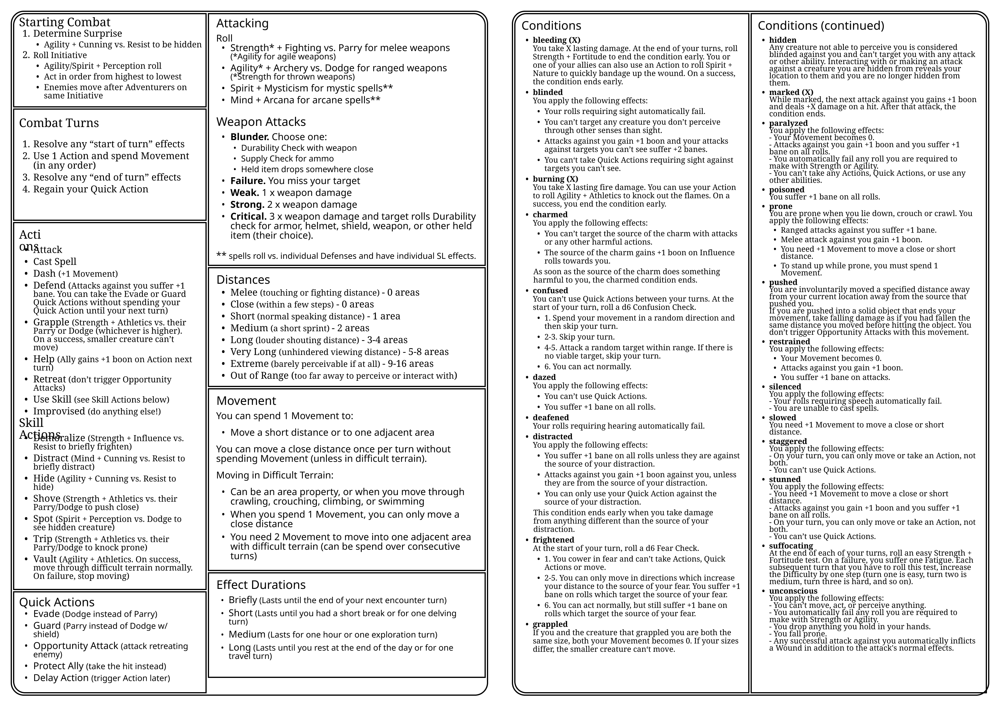

# 💥 Combat Scenes

## Starting Combat

At the start of combat, first, determine if one or more groups involved are surprised (see below). After that, everyone rolls for Initiative!

### Surprise

Whenever one group of combatants tries to get the upper hand on their foes, roll for surprise.

**Surprising Enemies**

If you attempt to surprise your enemies at the start of combat, each participating adventurer rolls Agility + Cunning against each of the enemies’ Resist. An adventurer is considered hidden from all the enemies they succeeded against.

**Getting Surprised**

If enemies try to surprise the adventurers on the other hand, each of the enemies has to roll Agility + Cunning against each of the adventurers’ Resist. An enemy is considered hidden from all adventurers they succeeded against.

### Initiative

When combat starts, all combatants roll Initiative (Agility/Spirit + Perception). This roll isn’t made against a set Difficulty, but instead acts as a order in which all combatants will act. All combatants will act in descending order (highest to lowest result). Between adventurers and enemies with the same Initiative result, adventurers act before enemies.

The initiative order remains the same for all rounds of the combat scene, but can be changed by certain effects and abilities.

## Combat Turns

During combat, adventurers and enemies can use one of a variety of Actions on their turn. In addition, all combatants get 1 Movement on their turns, with which they can move one area.

You can also drop, sheathe, draw, or switch weapons or other carried items on your turn without taking an Action (within reason).

### Using Battle Stances

Battle Stances are passive abilities that you can learn through talents. You can only have one Battle Stance active at a time and switch between them once on your turn. You can determine your active Battle Stance before combat starts unless you are surprised.

## Actions

The following actions are available to all combatants.

| Action | Effect |
| --- | --- |
| Attack | Attack with your weapon (see more under Attacking). |
| Cast Spell | Cast a Spell you know and have enough Focus for. |
| Dash | Double your Movement this turn. |
| Defend | Attacks against you suffer +1 bane. You can Evade or Guard without spending your Quick Action until your next turn. |
| Disarm | Target a creature in your melee range that is your size or smaller. Choose one item the target holds and roll Strength + Athletics vs. their Parry or Dodge (whichever is higher). For a two-handed item or shield, you suffer +1 bane on your roll. <b>Weak.</b> The chosen item is knocked to the ground directly below them. <b>Strong.</b> The chosen item is knocked away to a random close location or you can grab it with a free hand (your choice). <b>Critical.</b> The chosen item is knocked away to a random close location or you can grab it with a free hand (your choice). If it is knocked away, it is also stuck there. Any creature attempting to grab onto the item must roll Strength + Athletics as an Action. They pull the item free if they succeed. |
| Grapple | Attempt to lock your enemy into a grapple. Target a creature in your melee range. Roll Strength + Athletics vs. their Parry or Dodge (whichever is higher) considering both of your sizes: - A creature one size larger imposes +1 bane on rolls to grapple it and gains +1 boon on rolls to escape the smaller creature grapple. - A creature smaller grants +1 boon on rolls to grapple it and suffers +1 bane on rolls to escape the larger creature grapple for each size it is smaller. - A creature two or more sizes larger can’t be grappled, pushed, or knocked prone by the smaller creature.  On a success, you are both locked in a grapple. If both of you are of the same size, both your Movement becomes 0. If one of you is larger or smaller, the smaller creature automatically moves with the Movement of the larger creature. If any one of you is moved away by some effect, such as being pushed, the grapple ends.  The target can use their Action to roll Strength/Agility + Athletics against your Parry. On a success, they escape your grapple. You can also willingly end the grapple on your turn. |
| Help | Help an ally with a roll. Target an ally you are in melee range of. Announce for what Action you want to help your ally on their next turn. They gain +1 boon on that roll on their next turn. |
| Retreat | Enemies can‘t use Opportunity Attacks against you this turn, while you spend Movement. |
| Use Skill | There are different Actions you can take by rolling for a skill. See the list below for more details, or use an Improvised Action for any situation not covered by the existing Use Skill Actions. |
| Improvised | If you want to do anything plausible, but not covered by the rules or your adventurer sheet, you can still attempt it! Explain your intended results to the GM and they might let you roll for it. If it is not within your skill set, you might suffer +1 bane on the roll. You can for example attempt to trip an opponent, when you don't have the Trip Combat Art learned. The GM might rule that you gain the effects of the Trip Combat Art, but the attack deals no damage.  |

## Use Skills

Use a variety of skills during combat to help you and your allies or hinder your enemies.

| Action | Effect |
| --- | --- |
| Demoralize | Attempt to break an enemy’s spirit. Target an enemy in short range that can see and hear you. Roll Strength/Spirit + Influence vs. Resist. On a success, they are briefly frightened of you. You can only use this Action once against any individual creature. |
| Distract | Attempt to break an enemy’s focus. Target an enemy in short range that can see and hear you. Roll Mind + Cunning vs. Resist. On a success, they are briefly distracted by you. You can only use this Action once against any individual creature. |
| Hide | Attempt to hide from enemies that currently can‘t perceive you. Roll Agility + Cunning vs. Resist for all creatures you attempt to hide from. On a success, you are hidden from them. |
| Shove | Attempt to push an enemy away from you. Target an enemy you are in melee range of and that is the same size or smaller than you. Roll Strength + Athletics vs. their Parry or Dodge (whichever is higher). On a success, you push them a close distance away from you. |
| Spot | Attempt to spot any hidden or invisible enemy. They must be in your line of sight or range of hearing. Roll Spirit + Perception vs. Dodge. On a success, they are no longer hidden from you. |
| Trip | Attempt to knock an enemy to the ground. Target an enemy you are in melee range of and that is the same size or smaller than you. Roll Strength + Athletics vs. their Parry or Dodge (whichever is higher). On a success, you knock them prone. |
| Vault | Attempt to quickly cross difficult terrain. When entering difficult terrain, roll Agility + Athletics. On a success, you can move through it without spending extra Movement. On a failure, your Movement becomes 0 for the turn. |

## Quick Actions

Quick Actions are small actions that take no more than a few seconds. They can also be quick reactive abilities outside of your turn during combat. Quick Actions always have triggers for when they can be used. You can use one Quick Action on your turn or between your turns. You regain access to your Quick Action at the end of each of your turns.
You can also always substitute an ability using a Quick Action on your turn by using your Action instead.

| Quick Action | Trigger | Effect |
| --- | --- | --- |
| Evade | You are attacked by a melee or touch attack and don’t wear heavy armor. | Until your next turn, you can defend with your Dodge instead of your Parry. |
| Guard | While wearing a shield, you are targeted by a ranged attack or area effect. | Until your next turn, you can defend with your Parry instead of your Dodge. |
| Opportunity Attack | An enemy in your melee reach attempts to move out of melee (unless they are moved involuntarily by another source). | Roll an attack against the enemy with a melee weapon you wield. You can’t use any abilities or Combat Arts on this attack. Instead of an attack, you can also attempt to grapple the enemy if they are in melee range. |
| Protect Ally | When an ally close to you is attacked. | You quickly step into the way and take the hit instead. As part of this Quick Action, you move into melee range of your targeted ally. The enemy then rolls against your Defense. If they hit, you take the damage instead of your ally. |
| Delay Action | You can use your Quick Action on your turn to delay your Action until some condition is met. | You can use that delayed Action once the condition is met before your next turn.  |

# Combat Quick Sheet

You can print out this sheet to to quickly reference the key rules for combat at the table.

