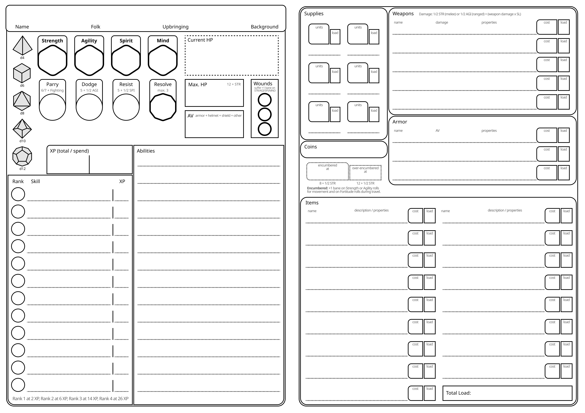

# 📋 Adventurer Creation

## Adventurer Creation Steps

When creating a new adventurer, follow the steps below:

1. **Choose your Attributes**
    - You start with a d6 in all attributes. You can then choose to increase one attribute to d8, but you must also decrease one to d4.
2. **Choose your Folk**
    - Also choose a culture for your folk. You learn the language of your chosen culture, in addition to the common language of the region.
3. **Choose your Upbringing**
4. **Choose your Background**
5. **Ask yourself the following questions** (you can also leave some of the questions open and determine them dynamically in the story during play)
    - Who is a good friend, colleague or important family member you can call for aid? (Write down as your Ally)
    - Who is a person in your life that you can rely on for information, knowledge, or skills? (Write down as your Contact)
    - Who did you anger, came into conflict with, or holds a grudge against you? (Write down as your Rival)
    - Why did you become an adventurer? Pick one of the following keywords or choose your own (Write down as your Motivation).
    *Duty, Fame, Fortune, Freedom, Justice, Knowledge, Power, Redemption, Revenge, Survival*
6. **Choose your Skills**
    - Choose a number of skills available from your upbringing and background to learn. If you would gain the same skill from both, you can choose another skill that would fit either your upbringing or background.
    - Spend 2 XP on three skills you learned from your Upbringing and Background each. The rest of the skills start at 0 XP.
        - If your group consists of less than four adventurers, each adventurer can spend 2 XP on another skill they have learned for each member they are below four.
        So if your group has three members, each one can spend 2 XP on another one skill. If it consists of two members, each one can spend 2 XP on another two skills.
    - Choose Talents for the skills you spend XP on.
    - If you learned Archery or Fighting, you learn Combat Arts for weapons of the learned skill. See the Combat Arts section for more details.
    - If you learned Arcana or Mysticism, you learn spells for the skill. See the Magic section for more details.
7. **Choose your Equipment**
    - Starting Items:
        - A backpack (holds up to 10 load, 1 load, 20 coin) and two pouches (each holds up to 2 load, 0 load, 5 coin)
        - Traveler‘s Clothes (0 load, 20 coin)
        - Hemp Rope (1 load, 20 coin), a camping kit (1 load, 50 coin), and one additional tool of your choice
        - Supplies: 2 units (d6, 1 load) of provisions and 2 units (d6, 1 load) of torches for light.
    - You also get 350 coins to spend on additional equipment and items.
        - Choosing a weapon that requires ammo gives you 2 units (d6) of that ammo for free
        - You keep coins you don’t spend
8. **Start with 1 Resolve and fill out the remaining statistics on your adventurer sheet**

## Advanced Adventurer Creation

For a play group which already has played Nexus RPG for a while and doesn‘t want to repeat the early phase of adventuring life for their characters, you can decide on one of the following advanced starts.

| Adventuring Tier | Attributes* | XP for Skills & Talents | Coins |
| --- | --- | --- | --- |
| Tier 2 (capable) | d8 / d6 / d6 / d6 | 10 XP total (max. 4 XP per skill) | 800 coins |
| Tier 3 (experienced) | d8 / d8 / d6 / d6 | 20 XP total (max. 8 XP per skill) | 2.000 coins |
| Tier 4 (seasoned) | d10 / d8 / d6 / d6 | 30 XP total (max. 12 XP per skill) | 5.000 coins |
| Tier 5 (heroic) | d10 / d10 / d6 / d6 | 40 XP total (max. 16 XP per skill) | 12.500 coins |
| Tier 6 (legendary) | d12 / d10 / d6 / d6 | 50 XP total (max. 20 XP per skill) | 30.000 coins |

* You can choose to increase one attribute by one step, but you must also decrease one other attribute by one step.

## Adventurer Sheet
You can print out this sheet to record your adventurer's statistics, equipment, and connections within the game world.
